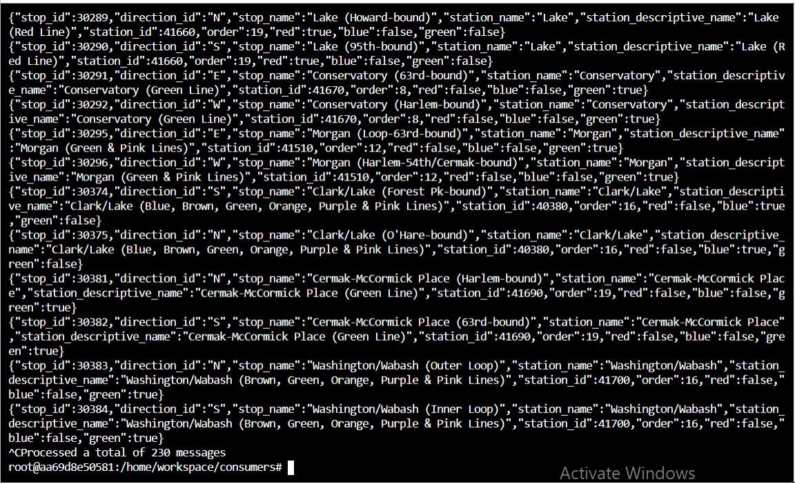

# Optimizing Public Transportation

# Project Directions
**Create Kafka Producers**
Configuration of the train stations to emit some of the events that we need. 

**Configure Kafka REST Proxy Producer**
I am using HTTP REST to send the data to Kafka from the hardware using Kafka's REST Proxy.

**Configure Kafka Connect**
I've decided to use the Kafka JDBC Source Connector.

**Configure the Faust Stream Processor**
I have to ingest data from our Kafka Connect topic, and transform the data.

**Configure the KSQL Table**
I will use KSQL to aggregate turnstile data for each of our stations. Recall that when I produced turnstile data, I simply emitted an event, not a count. 

**Create Kafka Consumers**
My final task is to consume the data in the web server that is going to serve the transit status pages to our commuters.

## Running the simulation
Run the producer and the consumer at the same time.


To run the producer:

If using Project Workspace:

cd producers
python simulation.py
If using your computer:

```
cd producers
virtualenv venv
. venv/bin/activate
pip install -r requirements.txt
python simulation.py
```
Once the simulation is running, you may hit Ctrl+C at any time to exit.

To run the Faust Stream Processing Application:
```
cd consumers
virtualenv venv
. venv/bin/activate
pip install -r requirements.txt
faust -A faust_stream worker -l info
```

To run the KSQL Creation Script:
```
cd consumers
virtualenv venv
. venv/bin/activate
pip install -r requirements.txt
python ksql.py
```

To run the consumer: (NOTE: Do not run the consumer until you have reached Step 6!)
```
cd consumers
virtualenv venv
. venv/bin/activate
pip install -r requirements.txt
python server.py
```

# Outputs
You can view the 230 stations defined in Postgres using:
`kafka-console-consumer --bootstrap-server localhost:9092 --topic "org.chicago.cta.stations" --from-beginning` to get
the following output.


